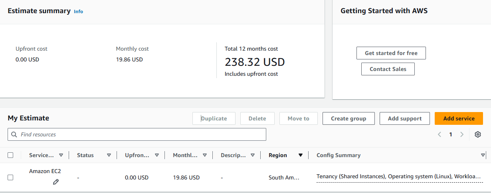
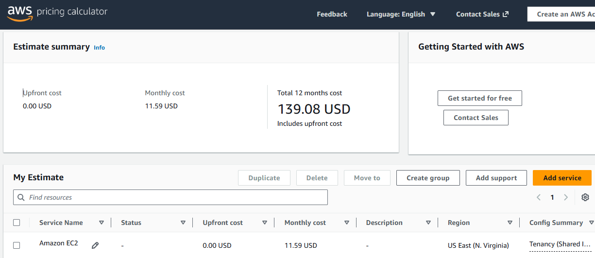

# FIAP - Faculdade de Informática e Administração Paulista

<p align="center">
<a href= "https://www.fiap.com.br/"></a>
</p>

<br>

# FarmTech Solutions - Machine Learning na Cabeça

## Grupo 49

## 👨‍🎓 Integrantes: 
- <a href="https://www.linkedin.com/in/guilherme-monteiro-tech/">Guilherme Monteiro Bitencourt (RM: 574151)</a>

## 👩‍🏫 Professores:
### Tutor(a) 
- <a href="https://www.linkedin.com/in/sabrina-otoni-22525519b/">Sabrina Otoni</a>
### Coordenador(a)
- <a href="https://www.linkedin.com/in/andregodoichiovato/">André Godoi</a>

## 📜 Descrição

A FarmTech Solutions presta serviços de Inteligência Artificial a uma fazenda de médio porte (200 hectares, aproximadamente 210 campos de futebol oficiais) que cultiva quatro culturas tropicais: cacau, dendê, arroz e seringueira. Esta Fase 5 compreende duas entregas: um estudo de Machine Learning sobre a base de rendimento de safra e o dimensionamento da infraestrutura em nuvem que hospedará a solução.

**Entrega 1 — Machine Learning.** A partir de uma base com quatro variáveis climáticas (precipitação, umidade específica, umidade relativa e temperatura) e o rendimento por cultura, o trabalho realiza análise exploratória, clusterização com K-Means para identificar regimes climáticos, detecção de cenários discrepantes e a construção de cinco modelos de regressão supervisionada comparados sob validação cruzada.

Três descobertas orientaram todas as decisões metodológicas do estudo.

A primeira é estrutural: a base contém apenas 39 observações climáticas distintas, cada uma repetida quatro vezes — uma por cultura. São 39 safras de uma única região. Essa constatação exigiu validação cruzada agrupada (`GroupKFold`) em lugar do `train_test_split` aleatório, evitando que a mesma safra aparecesse simultaneamente em treino e teste.

A segunda é estatística: a correlação entre clima e rendimento é praticamente nula quando calculada sobre a base agregada, mas isso é um artefato de agregação — um paradoxo de Simpson. Dentro de cada cultura o efeito existe e muda de sinal. O arroz responde positivamente a calor e umidade (correlações de aproximadamente 0,70 e 0,61), enquanto a seringueira responde negativamente às mesmas variáveis (aproximadamente -0,43 e -0,41). Efeitos opostos se cancelam na soma.

A terceira é a mais relevante para o cliente: o R² elevado dos modelos é enganoso. Um baseline que utiliza somente o nome da cultura, ignorando integralmente as variáveis climáticas, já atinge R² de 0,987. O melhor modelo completo alcança 0,989. O ganho atribuível a todo o conjunto de variáveis climáticas é da ordem de +0,002. Em outras palavras, o modelo prevê bem porque as culturas possuem rendimentos em ordens de grandeza distintas — o dendê rende aproximadamente vinte vezes mais que o cacau — e não porque tenha aprendido a relação entre condições meteorológicas e produtividade. O relatório reporta esse ganho marginal como métrica honesta da capacidade preditiva do sistema.

**Entrega 2 — Computação em Nuvem.** Foi realizada estimativa de custos na calculadora oficial da AWS para uma instância EC2 t3.micro (2 vCPUs, 1 GiB de memória, até 5 Gigabit de rede) com volume EBS gp3 de 50 GB, sistema Linux e cobrança On-Demand a 100% de utilização, comparando as regiões de São Paulo e Norte da Virgínia. A análise conclui pela região brasileira, por razões de conformidade legal e latência detalhadas na seção correspondente.

## 🤖 Entrega 1 — Machine Learning

### Notebook

Toda a análise, o código comentado e a discussão dos resultados estão no notebook:

**➡️ [`src/GuilhermeMonteiroBitencourt_rm574151_pbl_fase5.ipynb`](./src/GuilhermeMonteiroBitencourt_rm574151_pbl_fase5.ipynb)**

### Vídeo demonstrativo

**➡️ [Assistir no YouTube](INSERIR_LINK_AQUI)** *(não listado, até 5 minutos)*

### Desempenho dos modelos

Validação cruzada agrupada por observação climática, 5 folds:

| Modelo | R² | MAE | RMSE |
|---|---|---|---|
| Random Forest | 0,99 | 3.921 | 7.125 |
| Gradient Boosting | 0,99 | 4.161 | 7.395 |
| Regressão Linear | 0,99 | 5.223 | 7.930 |
| Ridge | 0,98 | 5.885 | 8.638 |
| SVR (RBF) | 0,95 | 10.951 | 15.926 |

O erro percentual por cultura é a métrica mais informativa para a operação: dendê e arroz ficam em torno de 6% e 8%, enquanto cacau e seringueira ficam próximos de 15%. Um R² global de 0,99 convive com erro de 15% nas culturas de menor rendimento.

## ☁️ Entrega 2 — Computação em Nuvem (AWS)

### Configuração dimensionada

| Recurso | Especificação |
|---|---|
| vCPUs | 2 |
| Memória | 1 GiB |
| Rede | Até 5 Gigabit |
| Armazenamento | 50 GB (EBS gp3) |
| Sistema operacional | Linux |
| Modelo de cobrança | On-Demand (100% de utilização) |
| Instância correspondente | EC2 t3.micro |

### Comparação de custos

| Região | Custo mensal (USD) | Custo 12 meses (USD) |
|---|---|---|
| América do Sul (São Paulo) — `sa-east-1` | **19,86** | **238,32** |
| Leste dos EUA (Norte da Virgínia) — `us-east-1` | **11,59** | **139,08** |
| **Diferença** | **+8,27** | **+99,24** |

A região de São Paulo é **71,4% mais cara** que a da Virgínia do Norte para a mesma configuração. Em valor absoluto, porém, a diferença é de 8,27 USD por mês — aproximadamente R$ 45,00.

<p align="center">

<br><em>Região de São Paulo (sa-east-1) — 19,86 USD/mês</em>
</p>

<p align="center">

<br><em>Região da Virgínia do Norte (us-east-1) — 11,59 USD/mês</em>
</p>

### Vídeo demonstrativo da comparação

**➡️ [Assistir no YouTube]https://youtu.be/bG3dmxqsPlk** 

### Justificativa técnica da escolha

**Região escolhida: América do Sul (São Paulo) — `sa-east-1`.**

A região da Virgínia do Norte apresenta custo inferior, o que é esperado: `us-east-1` é a região mais antiga e de maior escala da AWS, com preços historicamente mais baixos. Ainda assim, a escolha recai sobre São Paulo, por dois motivos que se sobrepõem ao critério econômico.

**1. Restrição legal — soberania de dados.** O enunciado estabelece que há restrições legais para armazenamento no exterior. No ordenamento brasileiro, a Lei Geral de Proteção de Dados (Lei 13.709/2018) condiciona a transferência internacional de dados a hipóteses específicas de adequação, cláusulas contratuais ou consentimento. Havendo exigência de manutenção dos dados em território nacional, a região americana fica descartada independentemente do preço — não se trata de variável a ser ponderada contra o custo, e sim de requisito eliminatório.

**2. Latência — requisito de acesso rápido.** A distância física entre São Paulo e a Virgínia do Norte é de aproximadamente 7.500 km. O tempo de ida e volta para `us-east-1` a partir do Brasil situa-se tipicamente entre 110 e 150 ms, contra 5 a 20 ms para `sa-east-1`. Como a arquitetura prevê sensores enviando telemetria continuamente e uma API respondendo com a inferência do modelo, essa diferença se acumula a cada requisição e degrada o monitoramento em tempo real da lavoura.

**Conclusão.** O sobrepreço de 71,4% da região de São Paulo corresponde, em valor absoluto, a 8,27 USD mensais — cerca de R$ 45,00, ou R$ 540,00 ao ano. Para uma operação agrícola de 200 hectares, esse montante é irrelevante frente ao custo de uma eventual não conformidade com a LGPD ou de uma latência que inviabilize o monitoramento em tempo real. A decisão é técnica e jurídica, não econômica: hospedar nos Estados Unidos economizaria menos de dez dólares por mês ao custo de descumprir requisito legal e degradar o desempenho da aplicação em campo.

## 📁 Estrutura de pastas

Dentre os arquivos e pastas presentes na raiz do projeto, definem-se:

- <b>assets</b>: arquivos relacionados a elementos não-estruturados deste repositório, como o logotipo da FIAP e as capturas de tela das estimativas da calculadora AWS.

- <b>document</b>: documentos do projeto solicitados pelas atividades. Contém o enunciado da Fase 5.

- <b>src</b>: todo o código fonte criado para o desenvolvimento do projeto. Contém o notebook Jupyter com a análise completa (`GuilhermeMonteiroBitencourt_rm574151_pbl_fase5.ipynb`) e a base de dados utilizada (`crop_yield.csv`).

- <b>README.md</b>: arquivo que serve como guia e explicação geral sobre o projeto (o mesmo que você está lendo agora).

## 🔧 Como executar o código

### Pré-requisitos

- Python 3.10 ou superior.
- Jupyter Notebook, JupyterLab ou Google Colab.
- Bibliotecas: `pandas`, `numpy`, `matplotlib`, `seaborn`, `scikit-learn` (versão 1.3 ou superior, pela utilização de `TransformedTargetRegressor` e `GroupKFold`).

### Passo a passo — execução local

1. **Clone o repositório** para a sua máquina:

```bash
git clone <url-do-repositorio>
cd <pasta-do-projeto>
```

2. **Instale as dependências**:

```bash
pip install pandas numpy matplotlib seaborn scikit-learn jupyter
```

3. **Abra o notebook**:

```bash
jupyter notebook src/GuilhermeMonteiroBitencourt_rm574151_pbl_fase5.ipynb
```

4. **Execute todas as células** em sequência (menu *Cell → Run All*). O arquivo `crop_yield.csv` deve estar no mesmo diretório do notebook.

### Passo a passo — execução no Google Colab

1. Acesse [colab.research.google.com](https://colab.research.google.com) e faça o upload do arquivo `.ipynb`.
2. No painel lateral de arquivos, faça o upload do `crop_yield.csv` para a sessão.
3. Execute o notebook pelo menu *Ambiente de execução → Executar tudo*.

### Reprodutibilidade

Todas as etapas que envolvem aleatoriedade utilizam semente fixa (`RANDOM_STATE = 42`), de modo que uma nova execução reproduz exatamente os números relatados neste README.

## 🗃 Histórico de lançamentos

* 0.5.0 - 08/09/2026
    * Fase 5: análise exploratória, clusterização com K-Means, detecção de outliers segmentada por cultura, cinco modelos de regressão supervisionada sob validação cruzada agrupada e dimensionamento de infraestrutura AWS com comparação entre as regiões de São Paulo e Norte da Virgínia.

## 📋 Licença

<p xmlns:cc="http://creativecommons.org/ns#" xmlns:dct="http://purl.org/dc/terms/"><a property="dct:title" rel="cc:attributionURL" href="https://github.com/agodoi/template">MODELO GIT FIAP</a> por <a rel="cc:attributionURL dct:creator" property="cc:attributionName" href="https://fiap.com.br">Fiap</a> está licenciado sobre <a href="http://creativecommons.org/licenses/by/4.0/?ref=chooser-v1" target="_blank" rel="license noopener noreferrer" style="display:inline-block;">Attribution 4.0 International</a>.</p>
